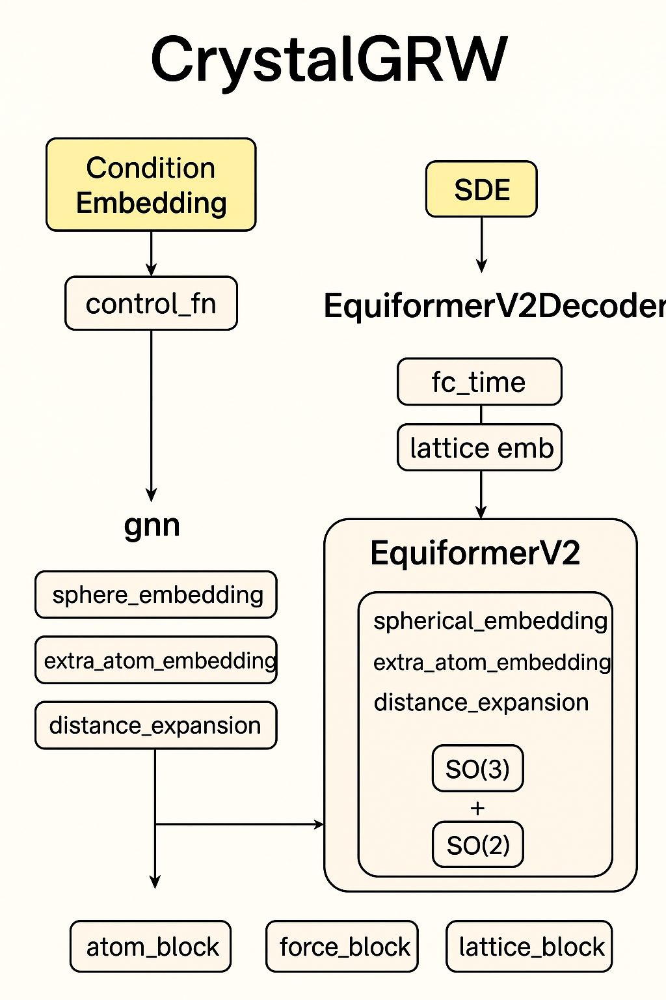

# 晶体生成

## 环境配置
```
# python版本: 3.10.16
conda create -n mpgem python=3.10.16

pip install torch==2.7.1 torchvision==0.22.1 torchaudio==2.7.1 --index-url https://download.pytorch.org/whl/cu126

pip install pyg-lib torch-scatter torch-sparse torch-cluster torch-spline-conv torch-geometric -f https://data.pyg.org/whl/torch-2.7.1+cu126.html

pip install -r requirements.txt

pip install lightning_utilities svgwrite importlib_resources
```

- 条件生成
- 可视化

## debug (非条件生成)

```
python main_mp20.py --device cpu --no-cuda --exp_name debug_mp20 --n_epochs 2 --batch_size 2 --test_epochs 1 --wandb_usr maochenwei-ustc --no_wandb --model DGAP --atom_type_pred 1
```

测试diffusion_another:

```
python main_mp20.py --device cpu --no-cuda --exp_name debug_mp20 --n_epochs 2 --batch_size 2  --test_epochs 1 --wandb_usr maochenwei-ustc --no_wandb --model DGAP  --atom_type_pred 1 --visualize_every_batch 10000 --num_train 100  --num_val 100 --num_test 100 --lambda_l 1.0 --lambda_a 1.0 --visulaize_epoch 1 --probabilistic_model diffusion_another
```

## debug (条件生成, 测试train_epoch中所有过程)

```
python main_mp20.py --device cpu --no-cuda --exp_name debug_mp20 --n_epochs 2 --batch_size 2  --test_epochs 1 --wandb_usr maochenwei-ustc --no_wandb --model DGAP --atom_type_pred 1 --property_pred 1 --target_property band_gap --visualize_every_batch 100 --num_train 1000 --conditioning band_gap 
```

## debug (测试test， visualize_every_batch设为10000即可)

```
python main_mp20.py --device cpu --no-cuda --exp_name debug_mp20 --n_epochs 2 --batch_size 2  --test_epochs 1 --wandb_usr maochenwei-ustc --no_wandb --model DGAP --atom_type_pred 1 --property_pred 1 --target_property band_gap --visualize_every_batch 10000 --num_train 1000 --conditioning band_gap --lambda_l 1.0 --lambda_a 1.0 --visulaize_epoch 0
```

## debug (frac_coords, 有test)

```
python main_mp20.py --device cpu --no-cuda --exp_name debug_mp20 --n_epochs 2 --batch_size 2  --test_epochs 1 --wandb_usr maochenwei-ustc --no_wandb --model DGAP --atom_type_pred 1 --property_pred 1 --target_property band_gap --visualize_every_batch 10000 --num_train 1000 --conditioning band_gap --lambda_l 1.0 --lambda_a 1.0 --visulaize_epoch 0 --frac_coords_mode 1
```

## train

```
CUDA_VISIBLE_DEVICES=0 python main_mp20.py --exp_name mp20_egnn_dynamics --n_epochs 200 --model DGAP --atom_type_pred 1 --test_epochs 10 --batch_size 64
```

## train diffusion_new

```
CUDA_VISIBLE_DEVICES=0 python main_mp20.py --exp_name train_mp20 --n_epochs 400 --batch_size 64  --test_epochs 20 --wandb_usr maochenwei-ustc --no_wandb --model DGAP --atom_type_pred 1  --n_report_steps 8  --visulaize_epoch 200 --visualize_every_batch 20000 --n_samples 20 --sample_batch_size 200 --lambda_l 0.1 --lambda_a 1.0 --probabilistic_model diffusion_new
```

## train diffusion_another
```
CUDA_VISIBLE_DEVICES=0 python main_mp20.py --exp_name train_mp20 --n_epochs 400 --batch_size 64  --test_epochs 20 --wandb_usr maochenwei-ustc --no_wandb --model DGAP --atom_type_pred 1  --n_report_steps 8  --visulaize_epoch 200 --visualize_every_batch 20000 --n_samples 20 --sample_batch_size 200 --lambda_l 1.0 --lambda_a 1.0 --probabilistic_model diffusion_another
```

服务器(wandb离线)
```
CUDA_VISIBLE_DEVICES=3 python main_mp20.py --exp_name train_mp20 --n_epochs 600 --batch_size 128 --test_epochs 10 --wandb_usr maochenwei-ustc --model DGAP --atom_type_pred 1 --n_report_steps 16 --visulaize_epoch 100 --visualize_every_batch 20000 --n_samples 20 --sample_batch_size 400 --lambda_l 1 --lambda_a 1 --online 0 --num_workers 0 --probabilistic_model diffusion_another
```

## train lattice predictor

```
CUDA_VISIBLE_DEVICES=0 python train_lattice_egnn.py --exp_name train_lattice --n_epochs 600 --batch_size 128 --test_epochs 10 --wandb_usr maochenwei-ustc --model DGAP --atom_type_pred 1 --n_report_steps 16 --visulaize_epoch 20 --visualize_every_batch 20000 --n_samples 20 --sample_batch_size 400 --lambda_l 1 --lambda_a 1 --online 0 --num_workers 0 --probabilistic_model diffusion_another
```

## train diffusion_pure_x

服务器(wandb离线)
```
CUDA_VISIBLE_DEVICES=0 python main_mp20.py --exp_name train_lattice --n_epochs 600 --batch_size 128 --test_epochs 10 --wandb_usr maochenwei-ustc --model DGAP --atom_type_pred 1 --n_report_steps 16 --visulaize_epoch 20 --visualize_every_batch 20000 --n_samples 20 --sample_batch_size 400 --lambda_l 1 --lambda_a 1 --online 0 --num_workers 0 --probabilistic_model diffusion_pure_x

```

## train diffusion_concat

服务器(wandb离线)
```
CUDA_VISIBLE_DEVICES=0 python main_mp20.py --exp_name train_lattice --n_epochs 600 --batch_size 128 --test_epochs 10 --wandb_usr maochenwei-ustc --model DGAP --atom_type_pred 1 --n_report_steps 16 --visulaize_epoch 20 --visualize_every_batch 20000 --n_samples 20 --sample_batch_size 400 --lambda_l 0.1 --lambda_a 0.1 --online 0 --num_workers 0 --probabilistic_model diffusion_concat
```


## 只test不可视化(unconditional)
```
CUDA_VISIBLE_DEVICES=0 python main_mp20.py --exp_name train_mp20 --n_epochs 400 --batch_size 64  --test_epochs 20 --wandb_usr maochenwei-ustc --no_wandb --model DGAP --atom_type_pred 1  --n_report_steps 8  --visulaize_epoch 200 --visualize_every_batch 20000 --n_samples 20 --sample_batch_size 200 --lambda_l 0.1 --lambda_a 1.0
```

### 实验室服务器上还需设置--online 0 --num_workers 0

## conditional train(no wandb)

```
CUDA_VISIBLE_DEVICES=0 python main_mp20.py --exp_name train_mp20 --n_epochs 300 --batch_size 128  --test_epochs 40 --wandb_usr maochenwei-ustc --no_wandb --model DGAP --atom_type_pred 1 --property_pred 1 --target_property band_gap --conditioning band_gap --n_report_steps 8  --visulaize_epoch 100 --visualize_every_batch 200 --n_samples 10 --sample_batch_size 1000 --lambda_l 1.0 --lambda_a 1.0
```

## CrystalGRW 运行

{: style="display:block; margin:0 auto;" width=50%}

```
export PYTHONPATH=./src
python scripts/train.py --config_path conf/mp20_condition.yaml --output_path output_dir --ddp False
```


## debug diffusion_transformer

```
python main_mp20.py --device cpu --no-cuda --exp_name debug_equiformer_mp20 --n_epochs 2 --batch_size 2  --test_epochs 1 --visulaize_epoch 1 --wandb_usr maochenwei-ustc --no_wandb --model DGAP  --atom_type_pred 1 --visualize_every_batch 10000 --num_train 100  --num_val 100 --num_test 100 --lambda_l 1.0 --lambda_a 1.0 --frac_coords_mode 1 --probabilistic_model diffusion_transformer --include_charges False
```

no frac mode:

```
python main_mp20.py --device cpu --no-cuda --exp_name debug_equiformer_mp20 --n_epochs 2 --batch_size 2  --test_epochs 1 --visulaize_epoch 1 --wandb_usr maochenwei-ustc --no_wandb --model DGAP  --atom_type_pred 1 --visualize_every_batch 10000 --num_train 20  --num_val 20 --num_test 20 --lambda_l 1.0 --lambda_a 1.0 --probabilistic_model diffusion_transformer --include_charges False
```

### debug diffusion_transformer, GPU并行

```
CUDA_VISIBLE_DEVICES=4,5 python main_mp20.py --device cuda --exp_name debug_equiformer_mp20 --n_epochs 2 --batch_size 2 --test_epochs 1  --visulaize_epoch 1 --wandb_usr maochenwei-ustc --no_wandb --model DGAP --atom_type_pred 1  --visualize_every_batch 20000 --num_train 100  --num_val 100 --num_test 100 --lambda_l 0.1 --lambda_a 0.1 --num_workers 0 --frac_coords_mode 1 --probabilistic_model diffusion_transformer --include_charges False --dp True
```

### diffusion_transformer 服务器(wandb 离线), single GPU

```
CUDA_VISIBLE_DEVICES=4 python main_mp20.py --exp_name train_equiformer_mp20 --n_epochs 600 --batch_size 32 --test_epochs 10  --visulaize_epoch 20 --wandb_usr maochenwei-ustc --model DGAP --atom_type_pred 1 --n_report_steps 16 --visualize_every_batch 20000 --n_samples 20 --sample_batch_size 400 --lambda_l 0.1 --lambda_a 0.1 --online 0 --num_workers 0 --frac_coords_mode 1 --probabilistic_model diffusion_transformer --include_charges False
```

### diffusion_transformer 服务器(wandb 离线), multi GPUs

```
CUDA_VISIBLE_DEVICES=0,1,2,3,4,5,6,7 python main_mp20.py --device cuda --dp True --exp_name train_equiformer_mp20 --n_epochs 600 --batch_size 64 --test_epochs 20  --visulaize_epoch 20 --wandb_usr maochenwei-ustc --model DGAP --atom_type_pred 1 --n_report_steps 16 --visualize_every_batch 20000 --n_samples 20 --sample_batch_size 25 --diffusion_steps 500  --lambda_l 0.1 --lambda_a 0.1 --online 0 --num_workers 0 --frac_coords_mode 1 --probabilistic_model diffusion_transformer --include_charges False --lr 1e-5
```

### diffusion_transformer 服务器(wandb 离线), multi GPUs(输出在train.log里)

```
CUDA_VISIBLE_DEVICES=0,1,2,3,4,5 python -u main_mp20.py --device cuda --dp True --exp_name train_equiformer_mp20 --n_epochs 1000 --batch_size 192 --test_epochs 20  --visulaize_epoch 40 --wandb_usr maochenwei-ustc --model DGAP --atom_type_pred 1 --n_report_steps 16 --visualize_every_batch 20000 --n_samples 20 --sample_batch_size 25 --diffusion_steps 500  --lambda_l 0.1 --lambda_a 0.1 --online 0 --num_workers 0 --frac_coords_mode 1 --probabilistic_model diffusion_transformer --include_charges False --lr 1e-4 > train.log 2>&1
```

### diffusion_transformer 服务器(wandb 离线), multi GPUs, no frac mode, 输出在train.log

```
CUDA_VISIBLE_DEVICES=0,1,2,3,4,5 nohup python -u main_mp20.py --device cuda --dp True --exp_name train_equiformer_mp20 --n_epochs 1000 --batch_size 192 --test_epochs 20  --visulaize_epoch 40 --wandb_usr maochenwei-ustc --model DGAP --atom_type_pred 1 --n_report_steps 16 --visualize_every_batch 20000 --n_samples 20 --sample_batch_size 25 --diffusion_steps 500  --lambda_l 0.1 --lambda_a 0.1 --online 0 --num_workers 0 --probabilistic_model diffusion_transformer --include_charges False --lr 1e-4 > train.log 2>&1
``` 

### diffusion_Lfirst

```
CUDA_VISIBLE_DEVICES=0,1,2,3 nohup python -u main_mp20.py --device cuda --dp True --exp_name train_equiformer_mp20 --n_epochs 1000 --batch_size 128 --test_epochs 10 --visulaize_epoch 10 --wandb_usr maochenwei-ustc --model DGAP --atom_type_pred 1 --n_report_steps 16 --visualize_every_batch 20000 --n_samples 20 --sample_batch_size 20 --diffusion_steps 1000  --lambda_l 0.1 --lambda_a 1 --online 0 --num_workers 0 --probabilistic_model diffusion_Lfirst --include_charges False --lr 1e-4 --save_epoch 120 > train.log 2>&1 & 
```

### debug diffusion_L

```
python main_mp20.py --device cpu --no-cuda --exp_name debug_LatticeGen_mp20 --n_epochs 2 --batch_size 2  --test_epochs 1 --visulaize_epoch 1 --wandb_usr maochenwei-ustc --no_wandb --num_train 100  --num_val 100 --num_test 100 --lambda_l 1.0 --lambda_a 1.0 --probabilistic_model diffusion_L
```

### train diffusion_L / diffusion_L_another(本地训练)

```
CUDA_VISIBLE_DEVICES=0 nohup python -u main_mp20.py --device cuda --dp True --exp_name train_LatticeGen_mp20 --n_epochs 1000 --batch_size 128 --test_epochs 10 --visulaize_epoch 10 --wandb_usr maochenwei-ustc --n_report_steps 16 --visualize_every_batch 20000 --sample_batch_size 50 --diffusion_steps 1000  --lambda_l 1 --lambda_a 1 --online 0 --num_workers 0 --probabilistic_model diffusion_L --lr 1e-4 --save_epoch 120 > train_latticegen.log 2>&1 &
```

```
CUDA_VISIBLE_DEVICES=0 python -u main_mp20.py --device cuda --dp True --exp_name train_LatticeGen_mp20 --n_epochs 1000 --batch_size 128 --test_epochs 10 --visulaize_epoch 10 --wandb_usr maochenwei-ustc --n_report_steps 16 --visualize_every_batch 20000 --sample_batch_size 50 --diffusion_steps 1000  --lambda_l 1 --lambda_a 1 --num_workers 0 --probabilistic_model diffusion_L_another --lr 1e-4 --save_epoch 50 
```

#### only sample lattice

```
python main_L_sample.py --device cpu --no-cuda --exp_name debug_LatticeSample_mp20 --sample_batch_size 100 --n_epochs 2 --batch_size 2  --test_epochs 1 --visulaize_epoch 1 --wandb_usr maochenwei-ustc --no_wandb --num_train 100  --num_val 100 --num_test 100 --lambda_l 1.0 --lambda_a 1.0 --probabilistic_model diffusion_L --pretrained_model ./outputs/train_LatticeGen_mp20/diffusion_L/generative_model.npy
```

### use diffison_L to sample x,h, the diffusion_Lhard

```
python main_Lhard_sample.py --device cpu --no-cuda --exp_name debug_equiformer_mp20 --sample_batch_size 25 --n_epochs 2 --batch_size 2  --test_epochs 1 --visulaize_epoch 1 --wandb_usr maochenwei-ustc --no_wandb --model DGAP  --atom_type_pred 1 --visualize_every_batch 10000 --num_train 20  --num_val 20 --num_test 20 --lambda_l 1.0 --lambda_a 1.0 --include_charges False --probabilistic_model diffusion_Lhard --pretrained_Lattice_model ./outputs/train_LatticeGen_mp20/diffusion_L/generative_model.npy --pretrained_model ./outputs/equiformer_generative_model.npy
```

#### diffusion_L_another + diffusion_Lhard, sample, 本地
```
python main_Lhard_sample.py --device cpu --no-cuda --exp_name debug_equiformer_mp20 --sample_batch_size 25  -
-wandb_usr maochenwei-ustc --no_wandb --model DGAP  --atom_type_pred 1 --lambda_l 1.0 --lambda_a 1.0 --include_charges False --probabilistic_model di
ffusion_Lhard --LatticeGenModel diffusion_L_another --pretrained_Lattice_model ./outputs/train_LatticeGen_mp20/diffusion_L_another/generative_model_e
ma.npy --pretrained_model ./outputs/train_Lhard_mp20/generative_model_ema_best_validity_epoch15.npy
```

### debug train diffusion_Lhard

```
python main_Lhard_train.py --device cpu --no-cuda --exp_name debug_Lhard_mp20 --n_epochs 2 --batch_size 2  --test_epochs 1 --visulaize_epoch 1 --wandb_usr maochenwei-ustc --no_wandb --model DGAP --atom_type_pred 1 --include_charges False --visualize_every_batch 20000 --num_train 20  --num_val 20 --num_test 20 --lambda_l 1.0 --lambda_a 1.0 --probabilistic_model diffusion_Lhard --pretrained_Lattice_model ./outputs/train_LatticeGen_mp20/diffusion_L/generative_model_ema.npy
```

### 服务器训练 diffusion_Lhard
```
CUDA_VISIBLE_DEVICES=1,2,3,4 nohup python -u main_Lhard_train.py --device cuda --dp True --exp_name train_Lhard_mp20  --wandb_usr maochenwei-ustc --model DGAP --atom_type_pred 1 --include_charges False --lr 1e-4 --n_epochs 1000 --batch_size 128 --test_epochs 5 --visulaize_epoch 5 --save_epoch 40 --n_report_steps 16 --visualize_every_batch 20000 --n_samples 20 --sample_batch_size 32 --diffusion_steps 1000 --lambda_l 1 --lambda_a 1 --online 0 --num_workers 0 --compute_novelty 1 --compute_novelty_epoch 150 --probabilistic_model diffusion_Lhard --pretrained_Lattice_model ./outputs/train_LatticeGen_mp20/diffusion_L/generative_model.npy  > train.log 2>&1 &
```

### 服务器利用cpu大规模采样，diffusion_Lhard

```
CUDA_VISIBLE_DEVICES=0 python -u main_Lhard_sample.py --device cuda --dp True --num_workers 0 --exp_name sample_Lhard --wandb_usr maochenwei-ustc --no_wandb --model DGAP --atom_type_pred 1 --lambda_l 1.0 --lambda_a 1.0 --include_charges False --compute_novelty 1 --compute_novelty_epoch 0 --visualize True --sample_batch_size 50 --probabilistic_model diffusion_Lhard --pretrained_Lattice_model ./outputs/train_LatticeGen_mp20/diffusion_L/generative_model.npy --pretrained_model ./outputs/train_Lhard_mp20/diffusion_Lhard/generative_model_ema_best_validity_epoch15.npy
```

```
nohup python -u main_Lhard_sample.py --device cpu --no-cuda --num_workers 0 --exp_name sample_Lhard --wandb_usr maochenwei-ustc --no_wandb --model DGAP --atom_type_pred 1 --lambda_l 1.0 --lambda_a 1.0 --include_charges False --compute_novelty 1 --compute_novelty_epoch 0 --visualize True --sample_batch_size 1000 --probabilistic_model diffusion_Lhard --pretrained_Lattice_model ./outputs/train_LatticeGen_mp20/diffusion_L/generative_model.npy --pretrained_model ./outputs/train_Lhard_mp20/diffusion_Lhard/generative_model_ema_best_validity_epoch15.npy --save_dir mp20/analyze_test/1104_sample_1000 > sample.log 2>&1 &
```

### debug train diffusion_LF
```
python main_LF_train.py --device cpu --no-cuda --exp_name debug_LF_mp20 --n_epochs 2 --batch_size 2  --test_e
pochs 1 --visulaize_epoch 1 --wandb_usr maochenwei-ustc --no_wandb --model DGAP --atom_type_pred 1 --include_charges False --visualize_every_batch 20000 --num_train 20  --num_val 20 --num_test 20 --lambda_l 1.0 --lambda_a 1.0 --probabilistic_model diffusion_LF --pretrained_Lattice_model ./outputs/train_LatticeGen_mp20/diffusion_L/generative_model_ema.npy
```