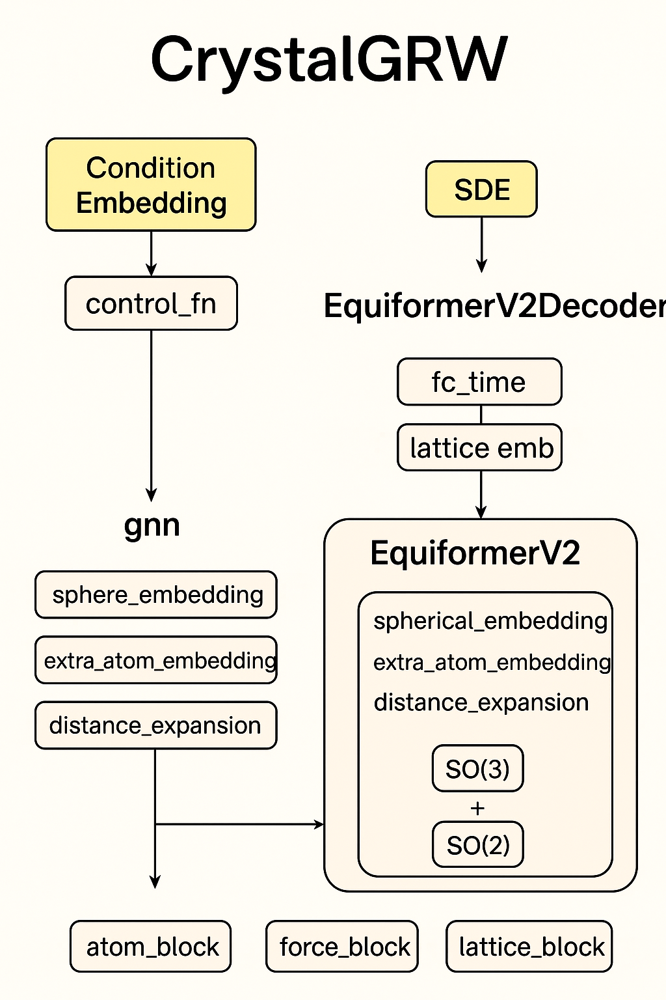

# 晶体生成

## 环境配置
```
# python版本: 3.10.16
conda create -n mpgem python=3.10.16

pip install torch==2.7.1 torchvision==0.22.1 torchaudio==2.7.1 --index-url https://download.pytorch.org/whl/cu126

pip install pyg-lib torch-scatter torch-sparse torch-cluster torch-spline-conv torch-geometric -f https://data.pyg.org/whl/torch-2.7.1+cu126.html

pip install -r requirements.txt

pip install lightning_utilities svgwrite importlib_resources
```

- 条件生成
- 可视化

## debug (非条件生成)

```
python main_mp20.py --device cpu --no-cuda --exp_name debug_mp20 --n_epochs 2 --batch_size 2 --test_epochs 1 --wandb_usr maochenwei-ustc --no_wandb --model DGAP --atom_type_pred 1
```

测试diffusion_another:

```
python main_mp20.py --device cpu --no-cuda --exp_name debug_mp20 --n_epochs 2 --batch_size 2  --test_epochs 1 --wandb_usr maochenwei-ustc --no_wandb --model DGAP  --atom_type_pred 1 --visualize_every_batch 10000 --num_train 100  --num_val 100 --num_test 100 --lambda_l 1.0 --lambda_a 1.0 --visulaize_epoch 1 --probabilistic_model diffusion_another
```

## debug (条件生成, 测试train_epoch中所有过程)

```
python main_mp20.py --device cpu --no-cuda --exp_name debug_mp20 --n_epochs 2 --batch_size 2  --test_epochs 1 --wandb_usr maochenwei-ustc --no_wandb --model DGAP --atom_type_pred 1 --property_pred 1 --target_property band_gap --visualize_every_batch 100 --num_train 1000 --conditioning band_gap 
```

## debug (测试test， visualize_every_batch设为10000即可)

```
python main_mp20.py --device cpu --no-cuda --exp_name debug_mp20 --n_epochs 2 --batch_size 2  --test_epochs 1 --wandb_usr maochenwei-ustc --no_wandb --model DGAP --atom_type_pred 1 --property_pred 1 --target_property band_gap --visualize_every_batch 10000 --num_train 1000 --conditioning band_gap --lambda_l 1.0 --lambda_a 1.0 --visulaize_epoch 0
```

## debug (frac_coords, 有test)

```
python main_mp20.py --device cpu --no-cuda --exp_name debug_mp20 --n_epochs 2 --batch_size 2  --test_epochs 1 --wandb_usr maochenwei-ustc --no_wandb --model DGAP --atom_type_pred 1 --property_pred 1 --target_property band_gap --visualize_every_batch 10000 --num_train 1000 --conditioning band_gap --lambda_l 1.0 --lambda_a 1.0 --visulaize_epoch 0 --frac_coords_mode 1
```

## train

```
CUDA_VISIBLE_DEVICES=0 python main_mp20.py --exp_name mp20_egnn_dynamics --n_epochs 200 --model DGAP --atom_type_pred 1 --test_epochs 10 --batch_size 64
```

## train diffusion_new

```
CUDA_VISIBLE_DEVICES=0 python main_mp20.py --exp_name train_mp20 --n_epochs 400 --batch_size 64  --test_epochs 20 --wandb_usr maochenwei-ustc --no_wandb --model DGAP --atom_type_pred 1  --n_report_steps 8  --visulaize_epoch 200 --visualize_every_batch 20000 --n_samples 20 --sample_batch_size 200 --lambda_l 0.1 --lambda_a 1.0 --probabilistic_model diffusion_new
```

## train diffusion_another
```
CUDA_VISIBLE_DEVICES=0 python main_mp20.py --exp_name train_mp20 --n_epochs 400 --batch_size 64  --test_epochs 20 --wandb_usr maochenwei-ustc --no_wandb --model DGAP --atom_type_pred 1  --n_report_steps 8  --visulaize_epoch 200 --visualize_every_batch 20000 --n_samples 20 --sample_batch_size 200 --lambda_l 1.0 --lambda_a 1.0 --probabilistic_model diffusion_another
```

服务器(wandb离线)
```
CUDA_VISIBLE_DEVICES=3 python main_mp20.py --exp_name train_mp20 --n_epochs 600 --batch_size 128 --test_epochs 10 --wandb_usr maochenwei-ustc --model DGAP --atom_type_pred 1 --n_report_steps 16 --visulaize_epoch 100 --visualize_every_batch 20000 --n_samples 20 --sample_batch_size 400 --lambda_l 1 --lambda_a 1 --online 0 --num_workers 0 --probabilistic_model diffusion_another
```

## train lattice predictor

```
CUDA_VISIBLE_DEVICES=0 python train_lattice_egnn.py --exp_name train_lattice --n_epochs 600 --batch_size 128 --test_epochs 10 --wandb_usr maochenwei-ustc --model DGAP --atom_type_pred 1 --n_report_steps 16 --visulaize_epoch 20 --visualize_every_batch 20000 --n_samples 20 --sample_batch_size 400 --lambda_l 1 --lambda_a 1 --online 0 --num_workers 0 --probabilistic_model diffusion_another
```

## train diffusion_pure_x

服务器(wandb离线)
```
CUDA_VISIBLE_DEVICES=0 python main_mp20.py --exp_name train_lattice --n_epochs 600 --batch_size 128 --test_epochs 10 --wandb_usr maochenwei-ustc --model DGAP --atom_type_pred 1 --n_report_steps 16 --visulaize_epoch 20 --visualize_every_batch 20000 --n_samples 20 --sample_batch_size 400 --lambda_l 1 --lambda_a 1 --online 0 --num_workers 0 --probabilistic_model diffusion_pure_x

```

## train diffusion_concat

服务器(wandb离线)
```
CUDA_VISIBLE_DEVICES=0 python main_mp20.py --exp_name train_lattice --n_epochs 600 --batch_size 128 --test_epochs 10 --wandb_usr maochenwei-ustc --model DGAP --atom_type_pred 1 --n_report_steps 16 --visulaize_epoch 20 --visualize_every_batch 20000 --n_samples 20 --sample_batch_size 400 --lambda_l 0.1 --lambda_a 0.1 --online 0 --num_workers 0 --probabilistic_model diffusion_concat
```


## 只test不可视化(unconditional)
```
CUDA_VISIBLE_DEVICES=0 python main_mp20.py --exp_name train_mp20 --n_epochs 400 --batch_size 64  --test_epochs 20 --wandb_usr maochenwei-ustc --no_wandb --model DGAP --atom_type_pred 1  --n_report_steps 8  --visulaize_epoch 200 --visualize_every_batch 20000 --n_samples 20 --sample_batch_size 200 --lambda_l 0.1 --lambda_a 1.0
```

### 实验室服务器上还需设置--online 0 --num_workers 0

## conditional train(no wandb)

```
CUDA_VISIBLE_DEVICES=0 python main_mp20.py --exp_name train_mp20 --n_epochs 300 --batch_size 128  --test_epochs 40 --wandb_usr maochenwei-ustc --no_wandb --model DGAP --atom_type_pred 1 --property_pred 1 --target_property band_gap --conditioning band_gap --n_report_steps 8  --visulaize_epoch 100 --visualize_every_batch 200 --n_samples 10 --sample_batch_size 1000 --lambda_l 1.0 --lambda_a 1.0
```

## CrystalGRW 运行

{: style="display:block; margin:0 auto;" width=50%}

```
export PYTHONPATH=./src
python scripts/train.py --config_path conf/mp20_condition.yaml --output_path output_dir --ddp False
```


## debug diffusion_transformer

```
python main_mp20.py --device cpu --no-cuda --exp_name debug_equiformer_mp20 --n_epochs 2 --batch_size 2  --test_epochs 1 --visulaize_epoch 1 --wandb_usr maochenwei-ustc --no_wandb --model DGAP  --atom_type_pred 1 --visualize_every_batch 10000 --num_train 100  --num_val 100 --num_test 100 --lambda_l 1.0 --lambda_a 1.0 --frac_coords_mode 1 --probabilistic_model diffusion_transformer --include_charges False
```

no frac mode:

```
python main_mp20.py --device cpu --no-cuda --exp_name debug_equiformer_mp20 --n_epochs 2 --batch_size 2  --test_epochs 1 --visulaize_epoch 1 --wandb_usr maochenwei-ustc --no_wandb --model DGAP  --atom_type_pred 1 --visualize_every_batch 10000 --num_train 20  --num_val 20 --num_test 20 --lambda_l 1.0 --lambda_a 1.0 --probabilistic_model diffusion_transformer --include_charges False
```

### debug diffusion_transformer, GPU并行

```
CUDA_VISIBLE_DEVICES=4,5 python main_mp20.py --device cuda --exp_name debug_equiformer_mp20 --n_epochs 2 --batch_size 2 --test_epochs 1  --visulaize_epoch 1 --wandb_usr maochenwei-ustc --no_wandb --model DGAP --atom_type_pred 1  --visualize_every_batch 20000 --num_train 100  --num_val 100 --num_test 100 --lambda_l 0.1 --lambda_a 0.1 --num_workers 0 --frac_coords_mode 1 --probabilistic_model diffusion_transformer --include_charges False --dp True
```

### diffusion_transformer 服务器(wandb 离线), single GPU

```
CUDA_VISIBLE_DEVICES=4 python main_mp20.py --exp_name train_equiformer_mp20 --n_epochs 600 --batch_size 32 --test_epochs 10  --visulaize_epoch 20 --wandb_usr maochenwei-ustc --model DGAP --atom_type_pred 1 --n_report_steps 16 --visualize_every_batch 20000 --n_samples 20 --sample_batch_size 400 --lambda_l 0.1 --lambda_a 0.1 --online 0 --num_workers 0 --frac_coords_mode 1 --probabilistic_model diffusion_transformer --include_charges False
```

### diffusion_transformer 服务器(wandb 离线), multi GPUs

```
CUDA_VISIBLE_DEVICES=0,1,2,3,4,5,6,7 python main_mp20.py --device cuda --dp True --exp_name train_equiformer_mp20 --n_epochs 600 --batch_size 64 --test_epochs 20  --visulaize_epoch 20 --wandb_usr maochenwei-ustc --model DGAP --atom_type_pred 1 --n_report_steps 16 --visualize_every_batch 20000 --n_samples 20 --sample_batch_size 25 --diffusion_steps 500  --lambda_l 0.1 --lambda_a 0.1 --online 0 --num_workers 0 --frac_coords_mode 1 --probabilistic_model diffusion_transformer --include_charges False --lr 1e-5
```

### diffusion_transformer 服务器(wandb 离线), multi GPUs(输出在train.log里)

```
CUDA_VISIBLE_DEVICES=0,1,2,3,4,5 python -u main_mp20.py --device cuda --dp True --exp_name train_equiformer_mp20 --n_epochs 1000 --batch_size 192 --test_epochs 20  --visulaize_epoch 40 --wandb_usr maochenwei-ustc --model DGAP --atom_type_pred 1 --n_report_steps 16 --visualize_every_batch 20000 --n_samples 20 --sample_batch_size 25 --diffusion_steps 500  --lambda_l 0.1 --lambda_a 0.1 --online 0 --num_workers 0 --frac_coords_mode 1 --probabilistic_model diffusion_transformer --include_charges False --lr 1e-4 > train.log 2>&1
```

### diffusion_transformer 服务器(wandb 离线), multi GPUs, no frac mode, 输出在train.log

```
CUDA_VISIBLE_DEVICES=0,1,2,3,4,5 nohup python -u main_mp20.py --device cuda --dp True --exp_name train_equiformer_mp20 --n_epochs 1000 --batch_size 192 --test_epochs 20  --visulaize_epoch 40 --wandb_usr maochenwei-ustc --model DGAP --atom_type_pred 1 --n_report_steps 16 --visualize_every_batch 20000 --n_samples 20 --sample_batch_size 25 --diffusion_steps 500  --lambda_l 0.1 --lambda_a 0.1 --online 0 --num_workers 0 --probabilistic_model diffusion_transformer --include_charges False --lr 1e-4 > train.log 2>&1
``` 

### diffusion_Lfirst

```
CUDA_VISIBLE_DEVICES=0,1,2,3 nohup python -u main_mp20.py --device cuda --dp True --exp_name train_equiformer_mp20 --n_epochs 1000 --batch_size 128 --test_epochs 10 --visulaize_epoch 10 --wandb_usr maochenwei-ustc --model DGAP --atom_type_pred 1 --n_report_steps 16 --visualize_every_batch 20000 --n_samples 20 --sample_batch_size 20 --diffusion_steps 1000  --lambda_l 0.1 --lambda_a 1 --online 0 --num_workers 0 --probabilistic_model diffusion_Lfirst --include_charges False --lr 1e-4 --save_epoch 120 > train.log 2>&1 & 
```

### debug diffusion_L

```
python main_mp20.py --device cpu --no-cuda --exp_name debug_LatticeGen_mp20 --n_epochs 2 --batch_size 2  --test_epochs 1 --visulaize_epoch 1 --wandb_usr maochenwei-ustc --no_wandb --num_train 100  --num_val 100 --num_test 100 --lambda_l 1.0 --lambda_a 1.0 --probabilistic_model diffusion_L
```

### train diffusion_L / diffusion_L_another(本地训练)

```
CUDA_VISIBLE_DEVICES=0 nohup python -u main_mp20.py --device cuda --dp True --exp_name train_LatticeGen_mp20 --n_epochs 1000 --batch_size 128 --test_epochs 10 --visulaize_epoch 10 --wandb_usr maochenwei-ustc --n_report_steps 16 --visualize_every_batch 20000 --sample_batch_size 50 --diffusion_steps 1000  --lambda_l 1 --lambda_a 1 --online 0 --num_workers 0 --probabilistic_model diffusion_L --lr 1e-4 --save_epoch 120 > train_latticegen.log 2>&1 &
```

```
CUDA_VISIBLE_DEVICES=0 python -u main_mp20.py --device cuda --dp True --exp_name train_LatticeGen_mp20 --n_epochs 1000 --batch_size 128 --test_epochs 10 --visulaize_epoch 10 --wandb_usr maochenwei-ustc --n_report_steps 16 --visualize_every_batch 20000 --sample_batch_size 50 --diffusion_steps 1000  --lambda_l 1 --lambda_a 1 --num_workers 0 --probabilistic_model diffusion_L_another --lr 1e-4 --save_epoch 50 
```

#### only sample lattice

```
python main_L_sample.py --device cpu --no-cuda --exp_name debug_LatticeSample_mp20 --sample_batch_size 100 --n_epochs 2 --batch_size 2  --test_epochs 1 --visulaize_epoch 1 --wandb_usr maochenwei-ustc --no_wandb --num_train 100  --num_val 100 --num_test 100 --lambda_l 1.0 --lambda_a 1.0 --probabilistic_model diffusion_L --pretrained_model ./outputs/train_LatticeGen_mp20/diffusion_L/generative_model.npy
```

### use diffison_L to sample x,h, the diffusion_Lhard

```
python main_Lhard_sample.py --device cpu --no-cuda --exp_name debug_equiformer_mp20 --sample_batch_size 25 --n_epochs 2 --batch_size 2  --test_epochs 1 --visulaize_epoch 1 --wandb_usr maochenwei-ustc --no_wandb --model DGAP  --atom_type_pred 1 --visualize_every_batch 10000 --num_train 20  --num_val 20 --num_test 20 --lambda_l 1.0 --lambda_a 1.0 --include_charges False --probabilistic_model diffusion_Lhard --pretrained_Lattice_model ./outputs/train_LatticeGen_mp20/diffusion_L/generative_model.npy --pretrained_model ./outputs/equiformer_generative_model.npy
```

#### diffusion_L_another + diffusion_Lhard, sample, 本地
```
python main_Lhard_sample.py --device cpu --no-cuda --exp_name debug_equiformer_mp20 --sample_batch_size 25  -
-wandb_usr maochenwei-ustc --no_wandb --model DGAP  --atom_type_pred 1 --lambda_l 1.0 --lambda_a 1.0 --include_charges False --probabilistic_model di
ffusion_Lhard --LatticeGenModel diffusion_L_another --pretrained_Lattice_model ./outputs/train_LatticeGen_mp20/diffusion_L_another/generative_model_e
ma.npy --pretrained_model ./outputs/train_Lhard_mp20/generative_model_ema_best_validity_epoch15.npy
```

### debug train diffusion_Lhard

```
python main_Lhard_train.py --device cpu --no-cuda --exp_name debug_Lhard_mp20 --n_epochs 2 --batch_size 2  --test_epochs 1 --visulaize_epoch 1 --wandb_usr maochenwei-ustc --no_wandb --model DGAP --atom_type_pred 1 --include_charges False --visualize_every_batch 20000 --num_train 20  --num_val 20 --num_test 20 --lambda_l 1.0 --lambda_a 1.0 --probabilistic_model diffusion_Lhard --pretrained_Lattice_model ./outputs/train_LatticeGen_mp20/diffusion_L/generative_model_ema.npy
```

### 服务器训练 diffusion_Lhard
```
CUDA_VISIBLE_DEVICES=1,2,3,4 nohup python -u main_Lhard_train.py --device cuda --dp True --exp_name train_Lhard_mp20  --wandb_usr maochenwei-ustc --model DGAP --atom_type_pred 1 --include_charges False --lr 1e-4 --n_epochs 1000 --batch_size 128 --test_epochs 5 --visulaize_epoch 5 --save_epoch 40 --n_report_steps 16 --visualize_every_batch 20000 --n_samples 20 --sample_batch_size 32 --diffusion_steps 1000 --lambda_l 1 --lambda_a 1 --online 0 --num_workers 0 --compute_novelty 1 --compute_novelty_epoch 150 --probabilistic_model diffusion_Lhard --pretrained_Lattice_model ./outputs/train_LatticeGen_mp20/diffusion_L/generative_model.npy  > train.log 2>&1 &
```

### 服务器利用cpu大规模采样，diffusion_Lhard

```
CUDA_VISIBLE_DEVICES=0 python -u main_Lhard_sample.py --device cuda --dp True --num_workers 0 --exp_name sample_Lhard --wandb_usr maochenwei-ustc --no_wandb --model DGAP --atom_type_pred 1 --lambda_l 1.0 --lambda_a 1.0 --include_charges False --compute_novelty 1 --compute_novelty_epoch 0 --visualize True --sample_batch_size 50 --probabilistic_model diffusion_Lhard --pretrained_Lattice_model ./outputs/train_LatticeGen_mp20/diffusion_L/generative_model.npy --pretrained_model ./outputs/train_Lhard_mp20/diffusion_Lhard/generative_model_ema_best_validity_epoch15.npy
```

```
nohup python -u main_Lhard_sample.py --device cpu --no-cuda --num_workers 0 --exp_name sample_Lhard --wandb_usr maochenwei-ustc --no_wandb --model DGAP --atom_type_pred 1 --lambda_l 1.0 --lambda_a 1.0 --include_charges False --compute_novelty 1 --compute_novelty_epoch 0 --visualize True --sample_batch_size 1000 --probabilistic_model diffusion_Lhard --pretrained_Lattice_model ./outputs/train_LatticeGen_mp20/diffusion_L/generative_model.npy --pretrained_model ./outputs/train_Lhard_mp20/diffusion_Lhard/generative_model_ema_best_validity_epoch15.npy --save_dir mp20/analyze_test/1104_sample_1000 > sample.log 2>&1 &
```

### debug train diffusion_LF
```
python main_LF_train.py --device cpu --no-cuda --exp_name debug_LF_mp20 --n_epochs 2 --batch_size 2  --sample_batch_size 2 --test_epochs 1 --visulaize_epoch 1 --wandb_usr maochenwei-ustc --no_wandb --model DGAP --atom_type_pred 1 --include_charges False --visualize_every_batch 20000 --num_train 20  --num_val 20 --num_test 20 --lambda_l 1.0 --lambda_a 1.0 --probabilistic_model diffusion_LF --pretrained_Lattice_model ./outputs/train_LatticeGen_mp20/diffusion_L/generative_model_ema.npy
```

### 服务器训练 diffusion_LF
```
CUDA_VISIBLE_DEVICES=3,4,5,6 nohup python -u main_LF_train.py --device cuda --dp True --exp_name train_LF_mp20  --wandb_usr maochenwei-ustc --model DGAP --atom_type_pred 1 --include_charges False --lr 1e-4 --n_epochs 1000 --batch_size 128 --test_epochs 5 --visulaize_epoch 5 --save_epoch 40 --n_report_steps 16 --visualize_every_batch 20000 --n_samples 20 --sample_batch_size 32 --diffusion_steps 1000 --lambda_l 1 --lambda_a 1 --online 0 --num_workers 0 --compute_novelty 1 --compute_novelty_epoch 150 --probabilistic_model diffusion_LF --pretrained_Lattice_model ./outputs/train_LatticeGen_mp20/diffusion_L/generative_model.npy  > train.log 2>&1 &
```

### debug, train and sample diffusion_LF_wrap
```
python main_LF_train.py --device cpu --no-cuda --exp_name debug_LF_mp20 --n_epochs 2 --batch_size 2  --sample_batch_size 2 --test_epochs 1 --visulaize_epoch 1 --num_rounds 2 --wandb_usr maochenwei-ustc --no_wandb --model DGAP --atom_type_pred 1 --include_charges False --visualize_every_batch 20000 --num_train 20  --num_val 20 --num_test 20 --lambda_l 1.0 --lambda_a 1.0 --lambda_type 0.1 --n_corrector_steps 1 --probabilistic_model diffusion_LF_wrap --pretrained_Lattice_model ./outputs/train_LatticeGen_mp20/diffusion_L/generative_model_ema.npy
```

### 服务器目录布局（代码与 outputs 分开）

- 代码目录：`~/mcw/MCW_GEM`
- 数据目录：`~/mcw/MCW_GEM/mp20`
- 输出目录：`~/data1/mcw/MCW_GEM/outputs`
- 说明：`main_LF_train.py` / `main_LF_sample.py` 内部会把 checkpoint 保存到相对路径 `outputs/...`，所以服务器上应先 `cd ~/data1/mcw/MCW_GEM`，再用绝对路径调用代码目录下的脚本。
- 注意：`~` 已经表示 home 目录，不要把路径写成 `~/mcw/data1/...`。

### 服务器训练 diffusion_LF_wrap（empty-graph / atom-type 修复版）
```
mkdir -p ~/data1/mcw/MCW_GEM/outputs ~/data1/mcw/MCW_GEM/mp20/analyze_test && cd ~/data1/mcw/MCW_GEM && CUDA_VISIBLE_DEVICES=3,4,5,6 nohup python -u ~/mcw/MCW_GEM/main_LF_train.py --device cuda --dp True --exp_name train_LF_mp20_emptygraph_atomtypefix_20260521 --wandb_usr maochenwei-ustc --model DGAP --atom_type_pred 1 --include_charges False --lr 1e-4 --n_epochs 1000 --batch_size 128 --test_epochs 10 --visulaize_epoch 10 --save_epoch 50 --n_report_steps 16 --visualize_every_batch 20000 --n_samples 20 --sample_batch_size 32 --diffusion_steps 1000 --lambda_l 1 --lambda_a 1 --lambda_type 0.1 --n_corrector_steps 1 --online 0 --num_workers 0 --compute_novelty 1 --compute_novelty_epoch 150 --probabilistic_model diffusion_LF_wrap --datadir ~/mcw/MCW_GEM/mp20 --dataset_folder_path ~/mcw/MCW_GEM/mp20/raw --pretrained_Lattice_model ~/data1/mcw/MCW_GEM/outputs/train_LatticeGen_mp20/diffusion_L/generative_model_ema.npy --save_dir ~/data1/mcw/MCW_GEM/mp20/analyze_test/train_LF_mp20_emptygraph_atomtypefix_20260521 > ~/data1/mcw/MCW_GEM/outputs/train_LF_mp20_emptygraph_atomtypefix_20260521.log 2>&1 &
```

### 服务器前台采样 diffusion_LF_wrap（实时看 tqdm 进度条）
```
mkdir -p ~/data1/mcw/MCW_GEM/outputs/sample_LF_mp20_emptygraph_atomtypefix_20260522_epoch100 && cd ~/data1/mcw/MCW_GEM && CUDA_VISIBLE_DEVICES=2 python -u ~/mcw/MCW_GEM/main_LF_sample.py --device cuda --dp True --num_workers 0 --exp_name sample_LF_mp20_emptygraph_atomtypefix_20260522_epoch100 --wandb_usr maochenwei-ustc --no_wandb --model DGAP --atom_type_pred 1 --lambda_l 1.0 --lambda_a 1.0 --lambda_type 0.1 --n_corrector_steps 1 --sample_seed 2026 --num_rounds 16 --include_charges False --compute_novelty 0 --compute_novelty_epoch 0 --visualize True --sample_batch_size 32 --probabilistic_model diffusion_LF_wrap --sde_type ve --datadir ~/mcw/MCW_GEM/mp20 --dataset_folder_path ~/mcw/MCW_GEM/mp20/raw --pretrained_Lattice_model ~/data1/mcw/MCW_GEM/outputs/train_LatticeGen_mp20/diffusion_L/generative_model_ema.npy --pretrained_model ~/data1/mcw/MCW_GEM/outputs/train_LF_mp20_emptygraph_atomtypefix_20260521/diffusion_LF_wrap/generative_model_ema_epoch100.npy --save_dir ~/data1/mcw/MCW_GEM/outputs/sample_LF_mp20_emptygraph_atomtypefix_20260522_epoch100 --debug-atom-types True --debug-atom-dir ~/data1/mcw/MCW_GEM/outputs/sample_LF_mp20_emptygraph_atomtypefix_20260522_epoch100/atom_type_debug
```

说明：
- 默认开启 final decode 的 all-H guard；它只作用于最后 atom type decode / top-k search，不影响训练。
- 几何主实验建议显式使用 `--lambda_sym 0.0`；当前 CLI 默认关闭 symmetry guidance。
- 若要做 ablation，可在命令末尾加：`--disable-all-h-guard True`
- symmetry guidance 小消融建议同一 checkpoint / seed 分别跑 `--lambda_sym 0.0` 和 `--lambda_sym 0.1`，再用下面的 geometry diagnostics 比较 close pairs。
- 若要改 rescue 搜索宽度或最少非 H 数量，可加：`--all-h-guard-topk 4 --all-h-guard-min-non-h 1`
- 开启 `--debug-atom-types True` 时，会额外写出：
  - `save_dir/atom_type_debug/atom_type_all_h_guard.jsonl`
  - `save_dir/atom_type_debug/atom_type_all_h_guard_summary.json`
  - `save_dir/atom_type_debug/geometry_repulsion_correction.jsonl`
  - `save_dir/atom_type_debug/geometry_repulsion_failures.jsonl`

### 服务器多卡采样 diffusion_LF_wrap（按 num_rounds 分片，不改采样逻辑）

- 原则：每张卡启动一个独立 `main_LF_sample.py` 进程，自动分配 `num_rounds`，每个 worker 写到 `save_dir/worker_XX`。
- launcher 参数里用 `--num-rounds` 和 `--sample-seed`；转发给 `main_LF_sample.py` 的参数放在 `--` 之后。
- worker 结束后会自动生成：
  - `save_dir/multi_gpu_manifest.json`
  - `save_dir/multi_gpu_summary.json`

```
cd ~/data1/mcw/MCW_GEM && python -u ~/mcw/MCW_GEM/scripts/sample_multi_gpu.py --gpus 0,1,2,3 --num-rounds 16 --sample-seed 2026 --save-dir ~/data1/mcw/MCW_GEM/outputs/sample_LF_mp20_emptygraph_atomtypefix_20260522_epoch100_multi_gpu -- --device cuda --dp True --num_workers 0 --exp_name sample_LF_mp20_emptygraph_atomtypefix_20260522_epoch100_multi_gpu --wandb_usr maochenwei-ustc --no_wandb --model DGAP --atom_type_pred 1 --lambda_l 1.0 --lambda_a 1.0 --lambda_type 0.1 --n_corrector_steps 1 --include_charges False --compute_novelty 0 --compute_novelty_epoch 0 --visualize True --sample_batch_size 32 --probabilistic_model diffusion_LF_wrap --sde_type ve --datadir ~/mcw/MCW_GEM/mp20 --dataset_folder_path ~/mcw/MCW_GEM/mp20/raw --pretrained_Lattice_model ~/data1/mcw/MCW_GEM/outputs/train_LatticeGen_mp20/diffusion_L/generative_model_ema.npy --pretrained_model ~/data1/mcw/MCW_GEM/outputs/train_LF_mp20_emptygraph_atomtypefix_20260521/diffusion_LF_wrap/generative_model_ema_epoch100.npy --debug-atom-types True
```

说明：
- 这条命令总共仍然采 `sample_batch_size * num_rounds = 32 * 16 = 512` 个样本。
- launcher 会自动把 16 轮均分到 4 张卡，并给每个 worker 加不同的 `sample_seed` 偏移，避免重复样本。
- 不要在 `--` 后面再手动传 `--num_rounds`、`--sample_seed`、`--save_dir`、`--debug-atom-dir`；这些会由 launcher 自动覆盖成每个 worker 的专属值。

### 采样后统计 all-H 样本
单卡或单 worker 输出目录：
```
cd ~/mcw/MCW_GEM && python scripts/debug_all_h_samples.py ~/data1/mcw/MCW_GEM/outputs/sample_LF_mp20_emptygraph_atomtypefix_20260522_epoch100/epoch_0 --debug-dir ~/data1/mcw/MCW_GEM/outputs/sample_LF_mp20_emptygraph_atomtypefix_20260522_epoch100/atom_type_debug
```

多卡 launcher 输出目录：
```
cd ~/mcw/MCW_GEM && python scripts/debug_all_h_samples.py ~/data1/mcw/MCW_GEM/outputs/sample_LF_mp20_emptygraph_atomtypefix_20260522_epoch100_multi_gpu
```

说明：
- 多卡版本会自动识别 `worker_XX` 子目录，并汇总所有 worker 的 `epoch_0` 和 `atom_type_debug`。
- `scripts/sample_multi_gpu.py` 结束后也会自动生成 `save_dir/multi_gpu_summary.json`，可直接查看总样本数、all-H 数和每个 worker 的统计。
- 若开启了 `--debug-atom-types True`，每个 worker 还会生成：
  - `save_dir/worker_XX/atom_type_debug/atom_type_all_h_guard.jsonl`
  - `save_dir/worker_XX/atom_type_debug/atom_type_all_h_guard_summary.json`

### 采样后统计 geometry validity
单卡或多卡输出目录都可以直接跑：
```
cd ~/mcw/MCW_GEM && conda run -n mpgem python scripts/diagnose_geometry_validity.py ~/data1/mcw/MCW_GEM/outputs/sample_LF_mp20_emptygraph_atomtypefix_20260522_epoch100_multi_gpu
```

输出：
- `geometry_diagnostics.csv`
- `geometry_diagnostics_summary.json`

若你的 lattice checkpoint 文件名是 `generative_model.npy` 而不是 `generative_model_ema.npy`，把上面命令中的对应路径替换掉即可。

### Offline Novelty Evaluation
对已经采样保存的 CIF 递归计算 novelty：
```
cd ~/MCW_GEM
PYTHONDONTWRITEBYTECODE=1 conda run -n mpgem python scripts/evaluate_novelty_from_cifs.py \
  --sample-glob "./outputs/sample_LF_mp20_2026*" \
  --mp20-root "./mp20" \
  --processed-dir "./mp20/precessed" \
  --output-dir "./outputs/novelty_eval_$(date +%Y%m%d_%H%M%S)" \
  --num-workers 8
```

输出文件：
- `novelty_summary.json`：总体 novelty、reference 信息、matcher 参数、denominator 定义和运行耗时。
- `novelty_per_sample.csv`：每个 CIF 的解析、有效性、novelty 和匹配 reference 信息。
- `novelty_failures.jsonl`：CIF 解析或 matcher 失败记录。
- `matched_pairs.jsonl`：非 novel 样本匹配到的 MP20 reference。

脚本默认复用当前采样评估定义：`StructureMatcher(stol=0.5, angle_tol=10, ltol=0.3)`，先对 valid generated structures 做 `group_structures`，再用每个 unique group 的代表结构和 `mp20/raw/all.csv` 中的 reference CIF 比较。

### Offline Uniqueness Evaluation
对已经采样保存的 CIF 递归计算 generated samples 内部的总体 uniqueness：
```
cd ~/MCW_GEM
PYTHONDONTWRITEBYTECODE=1 conda run -n mpgem python scripts/evaluate_uniqueness_from_cifs.py \
  --sample-glob "./outputs/sample_LF_mp20_2026*" \
  --output-dir "./outputs/uniqueness_eval_$(date +%Y%m%d_%H%M%S)" \
  --num-workers 8 \
  --valid-only True
```

输出文件：
- `uniqueness_summary.json`：总体 uniqueness、denominator 定义、matcher 参数、cluster 统计和运行耗时。
- `uniqueness_per_sample.csv`：每个 CIF 的解析、有效性、cluster 和 representative 信息。
- `uniqueness_clusters.jsonl`：每个 unique cluster 的代表结构和成员列表。
- `uniqueness_failures.jsonl`：CIF 解析、validity check 或 matcher 失败记录。

脚本默认复用当前采样评估定义：只对 `mp20.crystal.array_dict_to_crystal(...).valid` 的 generated CIF 计算，使用 `StructureMatcher(stol=0.5, angle_tol=10, ltol=0.3)` 的 `group_structures`，并报告 `unique cluster 数 / evaluated valid CIF 数`。

### Offline UN Rate Evaluation
UN Rate 使用 CrystalDiT-style 定义：`unique_representative=True` 且 `novel=True` 的 generated samples 数量除以 evaluated generated samples 数量。主指标不是 `unique_count` 中 novel 的比例，后者会作为辅助的 `novel_among_unique_rate` 输出。

方式 1：从已有 uniqueness / novelty 输出合并：
```
cd ~/MCW_GEM
PYTHONDONTWRITEBYTECODE=1 conda run -n mpgem python scripts/evaluate_un_rate_from_cifs.py \
  --uniqueness-dir "./outputs/uniqueness_eval" \
  --novelty-dir "./outputs/novelty_eval" \
  --output-dir "./outputs/un_rate_eval"
```

方式 2：从 CIF 直接计算；脚本会先调用已有 offline uniqueness / novelty 脚本，再合并结果：
```
cd ~/MCW_GEM
PYTHONDONTWRITEBYTECODE=1 conda run -n mpgem python scripts/evaluate_un_rate_from_cifs.py \
  --sample-glob "./outputs/sample_LF_mp20_2026*" \
  --mp20-root "./mp20" \
  --processed-dir "./mp20/precessed" \
  --output-dir "./outputs/un_rate_eval_$(date +%Y%m%d_%H%M%S)" \
  --num-workers 8 \
  --valid-only True
```

输出文件：
- `un_rate_summary.json`：UN Rate、uniqueness/novelty/per-sample denominator、merge 策略和 reference 信息。
- `un_rate_per_sample.csv`：每个 CIF 的 unique、novel、unique_and_novel、cluster 和 reference 匹配信息。
- `un_structures.jsonl`：所有 `unique_and_novel=True` 的样本。
- `un_rate_failures.jsonl`：parse、merge、helper、evaluated flag 或 formula mismatch 等失败记录。

### Figure 5: MACE-relaxed Generated Sample Visualization

从 MACE-relaxed CIF 中筛选同时满足 structure-valid、composition-valid、unique、novel 的 100 个样本：
```
cd ~/MCW_GEM
PYTHONDONTWRITEBYTECODE=1 conda run -n mpgem python scripts/select_mace_relaxed_visualization_samples.py \
  --cif-dir outputs/20260601_mace_relax_final_256 \
  --target-count 100 \
  --output-dir outputs/visualization/generated_samples_mace_relaxed_100 \
  --min-distance 0.5 \
  --exclude-single-element \
  --exclude-hydrogen \
  --validity-csv outputs/eval/validity_per_sample.csv \
  --uniqueness-csv outputs/eval/uniqueness_per_sample.csv \
  --novelty-csv outputs/eval/novelty_per_sample.csv
```

如果不提供 `--uniqueness-csv` 或 `--novelty-csv`，脚本默认会尝试调用已有 offline uniqueness / novelty 脚本生成 per-sample CSV；正式论文作图建议显式传入已确认的评估 CSV。

批量渲染选中的 CIF：
```
cd ~/MCW_GEM
PYTHONDONTWRITEBYTECODE=1 conda run -n mpgem python scripts/render_crystal_cifs_batch.py \
  --selected-csv outputs/visualization/generated_samples_mace_relaxed_100/selected/selected_samples.csv \
  --output-dir outputs/visualization/generated_samples_mace_relaxed_100/renders \
  --backend auto \
  --supercell auto \
  --image-size 1000
```

拼接 4 x 5 overview panels，方便人工挑选 Figure 5 样本：
```
cd ~/MCW_GEM
PYTHONDONTWRITEBYTECODE=1 conda run -n mpgem python scripts/make_generated_samples_overview_panels.py \
  --render-metadata outputs/visualization/generated_samples_mace_relaxed_100/renders/render_metadata.csv \
  --output-dir outputs/visualization/generated_samples_mace_relaxed_100/panels \
  --panel-rows 4 \
  --panel-cols 5
```

生成论文 Figure 5 的 2 x 4 final panel：
```
cd ~/MCW_GEM
PYTHONDONTWRITEBYTECODE=1 conda run -n mpgem python scripts/make_generated_samples_overview_panels.py \
  --render-metadata outputs/visualization/generated_samples_mace_relaxed_100/renders/render_metadata.csv \
  --output-dir outputs/visualization/generated_samples_mace_relaxed_100/panels \
  --final-ids sample_003 sample_018 sample_021 sample_034 sample_047 sample_052 sample_071 sample_096 \
  --final-output-prefix ~/papers/stage_decoupled_crystal_aaai/figures/fig5_generated_samples_mace_relaxed
```

```
CUDA_VISIBLE_DEVICES=3,4,5,6 nohup python -u main_LF_train.py --device cuda --dp True --exp_name train_LF_mp20  --wandb_usr maochenwei-ustc --model DGAP --atom_type_pred 1 --include_charges False --lr 1e-4 --n_epochs 1000 --batch_size 128 --test_epochs 10 --visulaize_epoch 10 --save_epoch 50 --n_report_steps 16 --visualize_every_batch 20000 --n_samples 20 --sample_batch_size 32 --diffusion_steps 1000 --lambda_l 1 --lambda_a 1 --lambda_type 0.1 --n_corrector_steps 1 --online 0 --num_workers 0 --compute_novelty 1 --compute_novelty_epoch 150 --probabilistic_model diffusion_LF_wrap --pretrained_Lattice_model ./outputs/train_LatticeGen_mp20/diffusion_L/generative_model.npy  > train.log 2>&1 &
```

```
CUDA_VISIBLE_DEVICES=0 nohup python -u main_LF_sample.py --device cuda --dp True --num_workers 0 --exp_name sample_LF --wandb_usr maochenwei-ustc --no_wandb --model DGAP --num_rounds 2 --atom_type_pred 1 --lambda_l 1.0 --lambda_a 1.0 --lambda_type 0.1 --n_corrector_steps 1 --include_charges False --compute_novelty 0 --compute_novelty_epoch 0 --visualize True --sample_batch_size 50 --probabilistic_model diffusion_LF_wrap --pretrained_Lattice_model ./outputs/train_LatticeGen_mp20/diffusion_L/generative_model_ema.npy --pretrained_model ./outputs/train_LF_mp20/diffusion_LF_wrap/generative_model_ema_epoch160.npy --save_dir ./outputs/1125_sample_50 > sample.log 2>&1 &
```
不后台运行的sample：
```
CUDA_VISIBLE_DEVICES=2 python -u main_LF_sample.py --device cuda --dp True --num_workers 0 --exp_name sample_LF --wandb_usr maochenwei-ustc --no_wandb --model DGAP --atom_type_pred 1 --lambda_l 1.0 --lambda_a 1.0 --lambda_type 0.001 --n_corrector_steps 1 --sample_seed 2000 --num_rounds 4 --include_charges False --compute_novelty 0 --compute_novelty_epoch 0 --visualize True --sample_batch_size 32 --probabilistic_model diffusion_LF_wrap --pretrained_Lattice_model ./outputs/train_LatticeGen_mp20/diffusion_L/generative_model_ema.npy --pretrained_model ./outputs/train_LF_mp20/diffusion_LF_wrap/generative_model_ema_epoch120.npy --save_dir ./outputs/1203_sample_128_2
```
若使用真实lattice,加上：--sample_realistic_LA 1 --batch_size 32


### 指定 SDE 为 VE-SDE
```
python main_LF_train.py --device cpu --no-cuda --exp_name debug_LF_mp20 --n_epochs 2 --batch_size 2  --sample_batch_size 2 --test_epochs 1 --visulaize_epoch 1 --num_rounds 2 --wandb_usr maochenwei-ustc --no_wandb --model DGAP --atom_type_pred 1 --include_charges False --visualize_every_batch 20000 --num_train 20  --num_val 20 --num_test 20 --lambda_l 1.0 --lambda_a 1.0 --lambda_type 0.1 --n_corrector_steps 0 --probabilistic_model diffusion_LF_wrap --pretrained_Lattice_model ./outputs/train_LatticeGen_mp20/diffusion_L/generative_model_ema.npy --sde_type ve
```

- 若使用原版，改为: --sde_type vp

### 目前表现最好的模型
VP-SDE(default)
```
CUDA_VISIBLE_DEVICES=5 python -u main_LF_sample.py --device cuda --dp True --num_workers 0 --exp_name sample_LF --wandb_usr maochenwei-ustc --no_wandb --model DGAP --atom_type_pred 1 --lambda_l 1.0 --lambda_a 1.0 --lambda_type 0.1 --n_corrector_steps 0 --sample_seed 202 --num_rounds 32 --include_charges False --compute_novelty 1 --compute_novelty_epoch 0 --visualize True --sample_batch_size 32 --probabilistic_model diffusion_LF_wrap --pretrained_Lattice_model ./outputs/train_LatticeGen_mp20/diffusion_L/generative_model_ema.npy --pretrained_model ./outputs/train_LF_mp20/diffusion_LF_wrap_1213_best/generative_model_ema_epoch70.npy --save_dir ./outputs/1221_sample_1024
```
VE-SDE 表现也相当强劲:
```
CUDA_VISIBLE_DEVICES=4 nohup python -u main_LF_sample.py --device cuda --dp True --num_workers 0 --exp_name sample_LF --wandb_usr maochenwei-ustc --no_wandb --model DGAP --atom_type_pred 1 --lambda_l 1.0 --lambda_a 1.0 --lambda_type 0.1 --n_corrector_steps 2 --sample_seed 2026 --num_rounds 16 --include_charges False --compute_novelty 1 --compute_novelty_epoch 0 --visualize True --sample_batch_size 32 --probabilistic_model diffusion_LF_wrap --sde_type ve --pretrained_Lattice_model ./outputs/train_LatticeGen_mp20/diffusion_L/generative_model_ema.npy --pretrained_model ./outputs/train_LF_mp20/diffusion_LF_wrap/generative_model_ema_epoch70.npy --save_dir ./outputs/0206_sample_512_ve > sample.log 2>&1 &
```

- 若使用 guidance（比如对称性），先小范围消融 `--lambda_sym 0.1`；几何主实验默认保持 `--lambda_sym 0.0`。
